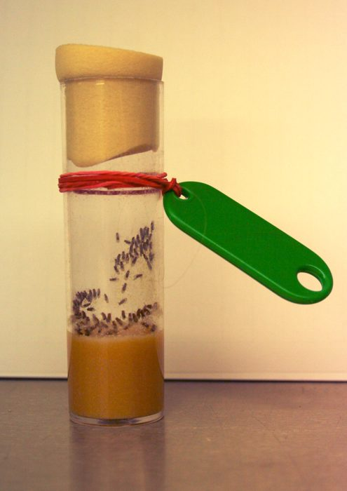

## ここまでの道具

- **勾配降下法**：傾きの逆方向に少しずつ進んで最小値を探す（最適化の回）
- **回帰**：体長→重さの直線を勾配降下で当て、sklearn と一致した（前回）
- **分類** — 決定境界の回では、直線を**目で見て**引いた


::: {.callout-note title="今回のテーマ"}
- [「斜めの直線で分けられそう」と言いながら、引けたのは縦線だけだった](classification-2d-boundaries.qmd#peek-diagonal){.peek}。
- **決定境界の斜めの最適な直線**を、機械に fit させられるか？
:::


## 分類問題で出てきた閾値の縦線

```{python}
#| echo: false
#| fig-align: center
#| classes: fig-medium
import numpy as np
import matplotlib.pyplot as plt
import japanize_matplotlib
plt.rcParams["font.size"] = 11
plt.rcParams["figure.dpi"] = 100

salmon_weights     = np.array([2149, 1959, 2194, 2457, 1930, 1930, 2474, 2230, 1859, 2163,
                               1861, 1860, 2073, 1426, 1483, 1831, 1696, 2094, 1728, 1576,
                               2028, 1903, 2057, 2229, 1884, 1884, 2240, 2081, 1838, 2037,
                               1839, 1838, 1978, 1554, 1591, 1820, 1731, 1992, 1752, 1652])
salmon_brightness  = np.array([3.5, 5.8, 4.9, 4.4, 2.6, 2.6, 2.2, 5.5, 4.4, 4.8, 2.1,
                               5.9, 5.3, 2.8, 2.7, 2.7, 3.2, 4.1, 3.7, 3.2, 4.4, 2.6,
                               3.2, 3.5, 3.8, 5.1, 2.8, 4.1, 4.4, 2.2, 4.4, 2.7, 2.3,
                               5.8, 5.9, 5.2, 3.2, 2.4, 4.7, 3.8])
seabass_weights    = np.array([1677, 1327, 1486, 1440, 1857, 1476, 1749, 2203, 1979, 1468,
                               1496, 1737, 1099, 1341, 1748, 1563, 2181, 1414, 1286, 1333,
                               1787, 1445, 1505, 1204, 1381, 1513, 1259, 1567, 1370, 1432,
                               1370, 1864, 1488, 1278, 1657, 1245, 1533, 1096, 1223, 1531])
seabass_brightness = np.array([5.6, 7.5, 5.2, 9.5, 6.3, 8.3, 6.6, 7.6, 7.7, 5.9, 9.8,
                               8.9, 9.7, 9.5, 8.0, 9.6, 5.4, 6.0, 5.2, 6.6, 6.9, 6.4,
                               9.1, 6.8, 6.4, 7.7, 5.7, 9.0, 5.4, 9.9, 8.9, 6.0, 5.0,
                               9.1, 8.5, 8.6, 8.9, 5.4, 6.8, 5.6])

plt.figure(figsize=(6.5, 4.0))
plt.scatter(salmon_brightness, salmon_weights, c="black", marker="o", s=35,
            alpha=0.7, label="Salmon")
plt.scatter(seabass_brightness, seabass_weights, c="red", marker="s", s=35,
            alpha=0.7, label="Sea bass")
plt.axvline(x=5.5, color="blue", linestyle="--", linewidth=2.5, label="手で引いた縦線（輝度 5.5）")
plt.xlabel("輝度"); plt.ylabel("重さ (g)")
plt.title("目で見て引いた決定境界　正答率 86%")
plt.legend(fontsize=9, loc="upper left")
plt.grid(True, alpha=0.3)
plt.tight_layout()
plt.show()
```

- 決定境界の回で計算した閾値（輝度 5.5）の正答率は **86%**
- **冷静に考えれば斜め線**ならもっと上手く分離できそう


## このような直線を求めたい

```{python}
#| echo: false
#| fig-align: center
#| classes: fig-medium
bb = np.linspace(1.6, 10.4, 50)
plt.figure(figsize=(6.5, 4.0))
plt.scatter(salmon_brightness, salmon_weights, c="black", marker="o", s=35,
            alpha=0.7)
plt.scatter(seabass_brightness, seabass_weights, c="red", marker="s", s=35,
            alpha=0.7)
plt.plot(bb, 120 * bb + 1050, color="blue", linestyle="--", linewidth=2.5)
plt.text(2.0, 2560, "線の上 → Salmon", fontsize=12, color="#2c3e50", fontweight="bold")
plt.text(7.0, 1030, "線の下 → Sea bass", fontsize=12, color="#c0392b", fontweight="bold")
plt.xlabel("輝度"); plt.ylabel("重さ (g)")
plt.ylim(950, 2700)
plt.title("手で引いた斜めの線　正答率 91%")
plt.grid(True, alpha=0.3)
plt.tight_layout()
plt.show()
```

- 例えば、この直線の正答率は **91%**（縦線は 86% ）
   - 図の直線の式：$\text{重さ} = 120 \times \text{輝度} + 1050$
- **この線さえあれば、判別は「線の上か下か」だけでいい**
   - **決定境界**
- ただし直線のパラメータは無限に考えられる
   - どのパラメータなら分離性能が良いかを計算で求める。
      - つまり、パラメータ最適化する


## 【注意】決定境界は回帰直線ではない

```{python}
#| echo: false
#| fig-align: center
weights_all = np.concatenate([salmon_weights, seabass_weights]).astype(float)
rng = np.random.default_rng(42)
lengths = np.round(np.cbrt(weights_all) * 4.5 + rng.normal(0, 1.0, len(weights_all)), 1)
a_reg, b_reg = np.polyfit(lengths, weights_all, 1)

fig, axes = plt.subplots(1, 2, figsize=(11, 3.8))
gx = np.linspace(lengths.min(), lengths.max(), 50)
axes[0].scatter(lengths, weights_all, alpha=0.6, s=30, c="#5dade2", edgecolors="gray")
axes[0].plot(gx, a_reg * gx + b_reg, "r-", lw=2.5)
axes[0].set_title("前回：回帰直線 — 点の真ん中を通る", fontsize=11)
axes[0].set_xlabel("体長 (cm)"); axes[0].set_ylabel("重さ (g)")
bb = np.linspace(1.6, 10.4, 50)
axes[1].scatter(salmon_brightness, salmon_weights, c="black", marker="o", s=30, alpha=0.7)
axes[1].scatter(seabass_brightness, seabass_weights, c="red", marker="s", s=30, alpha=0.7)
axes[1].plot(bb, 120 * bb + 1050, "b--", lw=2.5)
axes[1].set_title("今回：決定境界 — 点の間を通る", fontsize=11)
axes[1].set_xlabel("輝度"); axes[1].set_ylabel("重さ (g)")
for ax in axes:
    ax.grid(True, alpha=0.3)
plt.tight_layout()
plt.show()
```


::: {.callout-note}
## 線形回帰と**見た目はそっくり**。でも役割は**正反対**

- **回帰直線**：縦軸の値（重さ）を**予測する**線
   - **点の真ん中**を通る
- **決定境界**： 2クラスを**分ける**線
   - **点の間**を通る
:::


## {background-color="white" .center .break-slide}

::: {.break-title}
モデルの構造
:::


## ロジスティック回帰（[Logistic Regression]{.en}） {#peek-logistic-structure}

```{.d2 sketch="true" width="90%"}
direction: right
X: "入力\nx₁（輝度）\nx₂（重さ）" { style.fill: "#e1f5ff" }
LR: "ロジスティック回帰" {
  A: "Step 1\n線形結合＋バイアス\nz = w₁x₁ + w₂x₂ + b" { style.fill: "#fff4e1" }
  S: "Step 2\nロジスティック関数\np = σ(z)" { shape: hexagon; style.fill: "#fdebd0" }
  A -> S
}
P: "確率 p\n（0〜1）" { style.fill: "#d5f5e3" }
X -> LR.A
LR.S -> P
```

- **ロジスティック回帰**：直線のパラメータを最適化して分類
- 中身は**2ステップ**
   - Step 1 ：**直線を仮定**
   - Step 2 ：**適合する確率を計算**

::: {.callout-note title="「回帰」なのに分類？"}
- 予測対象が 0/1 のラベルではなく「Salmon である**確率**」という連続値だから
- 確率として数値で回帰して、最後にしきい値 0.5 で分類している
   - とはいえこれは、苦しい言い訳で歴史的経緯で回帰とされているとしか言いようがない
:::


## Step 1：直線のモデルを仮定（線形結合＋バイアス） {#peek-logistic-linear}

$$z = w_1 x_1 + w_2 x_2 + b$$

- $x_1, x_2$：入力（輝度、重さ）
- $w_1, w_2$：**重み（[weight]{.en}）**（どの特徴量をどれだけ重視するか）
- $b$：**バイアス（[bias]{.en}）**（直線の切片）

::: {.takeaway}
魚1匹の $x_1, x_2$ を入力すると、$z$ という**1つの値**にまとまる
:::


## 見慣れた式

- $z = 0$ と置くと：

$$\underbrace{w_1}_{A}\, x_1 + \underbrace{w_2}_{B}\, x_2 + \underbrace{\;b\;}_{C} = 0$$

- **直線の式 $Ax_1 + Bx_2 + C = 0$** そのもの
   - この直線を決定境界とする
- $z$ の**符号**が「線の上か下か」を表現
- $z$ の**大きさ**が「線からの遠さ」を表現

```{python}
#| echo: false
#| fig-align: center
#| classes: fig-small
xx1 = np.linspace(-0.5, 4.5, 50)
plt.figure(figsize=(6.2, 3.2))
plt.fill_between(xx1, 2 - xx1, 4.5, color="#f5b7b1", alpha=0.4)
plt.fill_between(xx1, -1.5, 2 - xx1, color="#aed6f1", alpha=0.4)
plt.plot(xx1, 2 - xx1, "b--", lw=2.5)
plt.scatter([3, 1], [2, 0.5], c="#2c3e50", s=55, zorder=5)
plt.annotate("z = +3（線から遠い）", (3, 2), xytext=(1.5, 2.9), fontsize=10,
             arrowprops={"arrowstyle": "->", "color": "gray"})
plt.annotate("z = −0.5（線に近い）", (1, 0.5), xytext=(1.5, -1.1), fontsize=10,
             arrowprops={"arrowstyle": "->", "color": "gray"})
plt.text(3.0, 3.7, "z > 0 の側", fontsize=11, color="#c0392b", fontweight="bold")
plt.text(-0.3, -0.2, "z < 0 の側", fontsize=11, color="#2471a3", fontweight="bold")
plt.xlim(-0.5, 4.5); plt.ylim(-1.5, 4.5)
plt.xlabel("$x_1$"); plt.ylabel("$x_2$")
plt.title("例：$z = x_1 + x_2 - 2$ の場合", fontsize=11)
plt.grid(True, alpha=0.3)
plt.tight_layout()
plt.show()
```

::: {.callout-note title="最適化の対象"}
-  **$A, B, C$（ここでは $w_1, w_2, b$）** をパラメータとして最適化する
:::


## Step 2：$z$ を「確率」にする — ロジスティック関数 {#peek-logistic-function}

$$p=\sigma(z)=\frac{1}{1+e^{-z}}$$

- $\sigma$ がロジスティック関数、$z$ がその入力、$p$ が関数から得られる出力

$$p = \sigma(w_1 x_1 + w_2 x_2 + b)
= \frac{1}{1 + e^{-(w_1 x_1 + w_2 x_2 + b)}}$$

```{python}
#| echo: false
#| fig-align: center
zz = np.linspace(-6, 6, 200)
plt.figure(figsize=(5.5, 2.8))
plt.plot(zz, 1 / (1 + np.exp(-zz)), color="#e74c3c", lw=2.5)
plt.axhline(0.5, color="gray", ls=":", lw=1)
plt.axvline(0, color="gray", ls=":", lw=1)
plt.xlabel("z"); plt.ylabel("p = σ(z)")
plt.title("ロジスティック関数")
plt.grid(True, alpha=0.3)
plt.tight_layout()
plt.show()
```

- zの取りうる範囲である実数全体 $(-\infty, +\infty)$ を **0〜1 の範囲**に押し込む
- [S字形の関数なので、機械学習では単に `sigmoid` と呼ぶことも多い](#peek-logistic-name){.peek}
- $p \geq 0.5$ → Salmon、$p < 0.5$ → Sea bass と判定するとしましょう
- $z = 0$（＝決定境界の上）のとき、ちょうど $p = 0.5$
- 判定だけなら $z$ の符号で足りるが、$p$ は「**どれくらい自信があるか**」まで持っている
   - これが学習の鍵になる


## $z = 1$ を実際に確率へ変換する

- 実際に $z = 1$ のロジスティック関数を計算：

$$p = \sigma(1) = \frac{1}{1 + e^{-1}} \approx 0.731$$

- $z=1$ の魚を、Salmon である確率 $73.1\%$ と解釈できる


## ロジスティック関数を微分する {#peek-chain-rule}

- ロジスティック関数の傾きを、先に求めておく
   - 勾配降下法で学習するには微分（傾き）が必要
- 合成関数は、**外側の微分 × 内側の微分**：

$$
\frac{d}{dx}f(g(x))=f'(g(x))\,g'(x),
\qquad
\frac{dy}{dx}=\frac{dy}{du}\frac{du}{dx}
$$

- $p=(1+e^{-z})^{-1}$ を合成関数として微分する：
   - 外側：$(\;)^{-1}$
   - 内側：$1+e^{-z}$（[指数関数の微分](#peek-exp-derivative){.peek}）

$$\begin{aligned}
\frac{dp}{dz}
&=\underbrace{-(1+e^{-z})^{-2}}_{\text{外側の微分}}
  \underbrace{(-e^{-z})}_{\text{内側の微分}} \\
&=\frac{e^{-z}}{(1+e^{-z})^2}
\end{aligned}$$


## 実は、微分結果は $p$ だけで表せる

- 微分した直後は、次の形になっている：

$$
\frac{dp}{dz}=\frac{e^{-z}}{(1+e^{-z})^2}
\tag{1}
$$

- 一方、ロジスティック関数の出力は $p=\dfrac{1}{1+e^{-z}}$
- $p(1-p)$ を計算すると、微分した直後と同じ形になる：

$$p(1-p)
=\frac{1}{1+e^{-z}}
 \left(1-\frac{1}{1+e^{-z}}\right)
=\frac{e^{-z}}{(1+e^{-z})^2}
\tag{2}$$

- (1)と(2)の右辺が同じなので、ロジスティック関数の微分は $p$ だけで書ける：

$$\therefore \qquad \frac{dp}{dz}=p(1-p)$$

::: {.takeaway}
$$
\text{出力： }p=\sigma(z)
\quad\Longrightarrow\quad
\text{傾き： }\frac{dp}{dz}=p(1-p)
$$
:::


## {background-color="white" .center .break-slide}

::: {.break-title}
勾配降下法でパラメータを学習する
:::


## ロジスティック回帰も勾配降下法で `fit` する

```{.d2 sketch="true" width="96%"}
direction: right
A: "現在のパラメータ\nw₁, w₂, b" { style.fill: "#fff4e1" }
B: "予測\nz → p" { style.fill: "#e1f5ff" }
C: "全魚の平均損失\nL" { style.fill: "#fdebd0" }
D: "微分\n勾配を求める" { style.fill: "#f5eef8" }
E: "更新\nパラメータを動かす" { style.fill: "#d5f5e3" }
A -> B -> C -> D -> E
E -> A: "繰り返す"
```

- 1匹分の損失を $\ell$、全魚の平均損失を $L$ と書き分ける
- 前の回と同じ更新式。$\alpha$（アルファ）は学習率：
   - コードではlearning rateを略して `lr` と書く

$$w_j \leftarrow w_j-\alpha\frac{\partial L}{\partial w_j},
\qquad b \leftarrow b-\alpha\frac{\partial L}{\partial b}$$

- ここで$j$ は「どの特徴量の重みか」を表す添字
   - ここでは $j=1$（輝度）、$j=2$（重さ）
- ロジスティック回帰で必要なのは：
   - 予測をどう採点するか：**損失 $L$**
   - 採点結果をどう微分するか：**勾配**


## 分類の確率

### 2クラスに属する確率はそれぞれ $p$ と $1-p$

- $p$：Salmon（$y=1$）になる確率
- 2クラスしかないので、Sea bass（$y=0$）になる確率は残りの $1-p$

$$P(y=1)=p, \qquad P(y=0)=1-p$$

- 例えば $p=0.4$ なら：
   - Salmon の確率は $0.4$
   - Sea bass の確率は $1-0.4=0.6$

::: {.takeaway}
1つの出力 $p$ は **両方のクラスの確率 $(p,\,1-p)$** を示している
:::


## 予測を採点する損失関数 — 交差エントロピー {#peek-cross-entropy}

- クラス $c$ ごとに、正解ラベル $y_c$ と予測確率 $p_c$ を用意する
   - 正解クラスだけ $y_c=1$、それ以外は $y_c=0$

$$
\ell(\mathbf{y},\mathbf{p})
=-\sum_c y_c\log p_c
$$

- $y_c=0$ の項は消えるので、正解クラスの項だけが残る
- 正解クラスに出した確率を $q$ と置けば：

$$\ell=-\log q$$

::: {.takeaway}
この損失関数を **交差エントロピー**（[cross entropy]{.en}）と呼ぶ
:::


## 2クラス版 — 二値交差エントロピー {#peek-binary-cross-entropy}

- クラスの順を（Salmon、Sea bass）とする
- Salmon の確率を $p$、正解ラベルを $y$ とすると：

$$\mathbf{y}=(y,\,1-y),\qquad \mathbf{p}=(p,\,1-p)$$

- この2つを一般の交差エントロピーへ代入すると：

$$\ell(y,p)=-\left[y\log p+(1-y)\log(1-p)\right]$$

- $y$ と $1-y$ は **0/1 のスイッチ**。正解側の項だけが残る

::: {.takeaway}
2クラス用交差エントロピーは **二値交差エントロピー**（[binary cross-entropy]{.en}）と呼ばれる
:::


## $p=0.4$ の魚を採点する {#peek-loss-value}

| 正解 | 採点する確率 $q$ | $p=0.4$ のときの損失 $-\log q$ |
|---|---:|---:|
| $y=1$（Salmon） | $q=p$ | $-\log(0.4)\approx0.92$ |
| $y=0$（Sea bass） | $q=1-p$ | $-\log(0.6)\approx0.51$ |

- 全魚の損失は平均する：$L=\dfrac{1}{N}\sum_i\ell(y_i,p_i)$


## −log の形：外すほど急に効く {#peek-neglog}

```{python}
#| echo: false
#| fig-align: center
qq = np.linspace(0.005, 1.0, 400)
plt.figure(figsize=(6.0, 3.2))
plt.plot(qq, -np.log(qq), color="#e74c3c", lw=2.5)
for qx, dx, dy, note in [(0.4, 0.05, 0.35, "q=0.4 → 損失 0.92"),
                         (0.99, -0.32, 0.55, "q=0.99 → 損失 0.01")]:
    lv = -np.log(qx)
    plt.scatter([qx], [lv], s=60, color="#2c3e50", zorder=5)
    plt.annotate(note, (qx, lv), xytext=(qx + dx, lv + dy), fontsize=10,
                 arrowprops={"arrowstyle": "->", "color": "gray"})
plt.xlabel("正解クラスに出した確率 q")
plt.ylabel("損失 −log q")
plt.ylim(-0.2, 5.5)
plt.grid(True, alpha=0.3)
plt.tight_layout()
plt.show()
```

- 正解クラスの確率が高い（$q \to 1$）ほど損失はほぼ 0
- 外れるほど**急カーブ**で跳ね上がる
- $q \to 0$（自信満々の間違い）では青天井
   - 急激に大きなlossになり都合がよい


## 二値交差エントロピーを $p$ で微分する {#peek-bce-derivative}

- **正解が $y=1$ のとき**：$\ell=-\log p$

$$\frac{\partial\ell}{\partial p}=-\frac{1}{p}$$

- **正解が $y=0$ のとき**：$\ell=-\log(1-p)$

$$\frac{\partial\ell}{\partial p}=\frac{1}{1-p}$$

::: {.takeaway}
ここで求めたのは、$p$ が変化したときに損失 $\ell$ がどれだけ変化するか
:::


## 2つの微分を掛けると $p-y$ になる {#peek-logistic-p-minus-y}

- $p$ は $z$ から計算されるので、連鎖律で2つの微分を掛ける：

$$
\frac{\partial\ell}{\partial z}
=\frac{\partial\ell}{\partial p}\frac{dp}{dz}
$$

- ロジスティック関数の微分は、どちらの正解でも同じ：

$$\frac{\partial p}{\partial z}=p(1-p)$$

- **正解が $y=1$ のとき**：

$$\frac{\partial \ell}{\partial z}
=\underbrace{\left(-\frac{1}{p}\right)}_{\partial\ell/\partial p}
 \underbrace{p(1-p)}_{dp/dz}
=-(1-p)=p-1=p-y \qquad (y=1)$$

- **正解が $y=0$ のとき**：

$$\frac{\partial \ell}{\partial z}
=\underbrace{\frac{1}{1-p}}_{\partial\ell/\partial p}
 \underbrace{p(1-p)}_{dp/dz}
=p=p-0=p-y \qquad (y=0)$$

::: {.takeaway}
なんと、どちらの正解でも
$$\frac{\partial \ell}{\partial z}=p-y$$
:::


## 1匹分の入力からパラメータの勾配が決まる {#peek-parameter-gradients}

- $z=w_1x_1+w_2x_2+b$ なので：

$$\frac{\partial z}{\partial w_j}=x_j, \qquad
\frac{\partial z}{\partial b}=1$$

- [いま求めた](#peek-logistic-p-minus-y){.peek} $\dfrac{\partial \ell}{\partial z}=p-y$ を使い、連鎖律（[chain rule]{.en}）で更新に必要な $w_j$ と $b$ の勾配を求める：

$$\frac{\partial \ell}{\partial w_j}
=\frac{\partial \ell}{\partial z}\frac{\partial z}{\partial w_j}
=(p-y)x_j, \qquad
\frac{\partial \ell}{\partial b}=p-y$$

- 先ほどの $p=0.4$、$y=1$（Salmon）の例なら、$p-y=0.4-1=-0.6$
- ある魚の入力を $x=(2,\,0.5)$ とすると：
   - $\dfrac{\partial \ell}{\partial w_1}=-0.6\times2=-1.2$
   - $\dfrac{\partial \ell}{\partial w_2}=-0.6\times0.5=-0.3$
   - $|x_1|$ が $|x_2|$ の4倍なので、$w_1$ の勾配も4倍

- 学習率 $\alpha$ を掛けて更新：

$$w_j \leftarrow w_j-\alpha(p-y)x_j, \qquad
b \leftarrow b-\alpha(p-y)$$

::: {.callout-important title="損失値そのものから勾配を求めたわけではない"}
先ほど計算した $0.92$ は、現在の予測がどれくらい悪いかを表す値であって、この値から勾配を求めるわけではないことに注意。更新に使うのは、**現在のパラメータ位置における損失関数の傾き（=勾配）** であって、lossそのものではない。数値はあくまで目安。
:::


## 1匹分の勾配をコードに置き換える {#peek-gradient-code}

数式の各部分へ、そのまま変数名を付ける：

```python
delta = p - y
d_w = delta * x
d_b = delta
```

| コード | 数式 | 意味 |
|---|---|---|
| `delta` | $p-y=\dfrac{\partial \ell}{\partial z}$ | 予測のずれが $z$ に与える勾配 |
| `d_w[j]` | $(p-y)x_j=\dfrac{\partial \ell}{\partial w_j}$ | 重み $w_j$ の勾配 |
| `d_b` | $p-y=\dfrac{\partial \ell}{\partial b}$ | バイアス $b$ の勾配 |

::: {.callout-note}
次回、NNとして実装するときは、この**出力側から各パラメータの勾配を求める処理**を `backward` と呼ぶ。
:::


## 実装：必要な関数は4つだけ {#peek-forward}

```{python}
#| echo: true
#| code-fold: true
#| code-summary: "魚データの定義（クリックして展開）"
import numpy as np

salmon_weights     = np.array([2149, 1959, 2194, 2457, 1930, 1930, 2474, 2230, 1859, 2163,
                               1861, 1860, 2073, 1426, 1483, 1831, 1696, 2094, 1728, 1576,
                               2028, 1903, 2057, 2229, 1884, 1884, 2240, 2081, 1838, 2037,
                               1839, 1838, 1978, 1554, 1591, 1820, 1731, 1992, 1752, 1652])
salmon_brightness  = np.array([3.5, 5.8, 4.9, 4.4, 2.6, 2.6, 2.2, 5.5, 4.4, 4.8, 2.1,
                               5.9, 5.3, 2.8, 2.7, 2.7, 3.2, 4.1, 3.7, 3.2, 4.4, 2.6,
                               3.2, 3.5, 3.8, 5.1, 2.8, 4.1, 4.4, 2.2, 4.4, 2.7, 2.3,
                               5.8, 5.9, 5.2, 3.2, 2.4, 4.7, 3.8])
seabass_weights    = np.array([1677, 1327, 1486, 1440, 1857, 1476, 1749, 2203, 1979, 1468,
                               1496, 1737, 1099, 1341, 1748, 1563, 2181, 1414, 1286, 1333,
                               1787, 1445, 1505, 1204, 1381, 1513, 1259, 1567, 1370, 1432,
                               1370, 1864, 1488, 1278, 1657, 1245, 1533, 1096, 1223, 1531])
seabass_brightness = np.array([5.6, 7.5, 5.2, 9.5, 6.3, 8.3, 6.6, 7.6, 7.7, 5.9, 9.8,
                               8.9, 9.7, 9.5, 8.0, 9.6, 5.4, 6.0, 5.2, 6.6, 6.9, 6.4,
                               9.1, 6.8, 6.4, 7.7, 5.7, 9.0, 5.4, 9.9, 8.9, 6.0, 5.0,
                               9.1, 8.5, 8.6, 8.9, 5.4, 6.8, 5.6])

X = np.column_stack([
    np.concatenate([salmon_brightness, seabass_brightness]),
    np.concatenate([salmon_weights,    seabass_weights])
])
y = np.array([1]*40 + [0]*40)   # 1=Salmon, 0=Sea bass

# スケールを揃える（クラスタリング回の教訓）
X_norm = (X - X.mean(axis=0)) / X.std(axis=0)

# Salmon, Sea bass, Salmon, ... と交互に並べ替えておく
order = np.empty(80, dtype=int)
order[0::2] = np.arange(0, 40)
order[1::2] = np.arange(40, 80)
X_norm = X_norm[order]
y      = y[order]
```

```{python}
#| echo: true
def sigmoid(z):
    return 1 / (1 + np.exp(-z))

def forward(X, w, b):
    """線形結合＋バイアス → シグモイド"""
    return sigmoid(X @ w + b)

def loss_fn(y_true, p):
    """全魚の二値交差エントロピーを平均する"""
    eps = 1e-10
    # log(0) は計算できないため、確率が厳密な 0 / 1 にならないようにする
    p = np.clip(p, eps, 1 - eps)
    return -np.mean(y_true * np.log(p) + (1 - y_true) * np.log(1 - p))

def accuracy(y_true, p):
    return np.mean((p >= 0.5) == y_true)
```


## 4つの関数の役割 {#peek-logistic-functions}

| 関数 | 役割 |
|---|---|
| `sigmoid` | $z$ を確率 $p$ に変換する |
| `forward` | 全魚の入力 $X$ から確率を予測する |
| `loss_fn` | 全魚の二値交差エントロピー $L$ を計算する |
| `accuracy` | $p\geq0.5$ を Salmon として正答率を計算する |

- 1匹分の勾配は、直前の `delta`、`d_w`、`d_b` の3行で計算する


## 魚を1匹ずつ見せて学習する {#peek-one-at-a-time}

- ここでは1匹分の損失 $\ell$ の勾配で更新する
   - 全魚の平均損失 $L$ を一度に使わず１匹分だけ
- 1匹見るたびにパラメータが少し動く

```{python}
#| echo: true
w = np.array([0.0, 0.0])   # Weights start at zero
b  = 0.0
lr = 0.5                       # 学習率

for i in range(10):
    xi, yi = X_norm[i], y[i]
    # この1匹の損失 ℓ の勾配で、パラメータを更新する
    p_i   = sigmoid(xi @ w + b)   # Forward：1匹だけ予測
    delta = p_i - yi
    d_w = delta * xi
    d_b = delta
    w = w - lr * d_w
    b     = b  - lr * d_b

    # 全魚の Loss と正答率は、学習の様子を表示するためだけに計算する
    p_all = forward(X_norm, w, b)
    print(f"{i+1}匹目 | Loss: {loss_fn(y, p_all):.4f} | 正答率: {accuracy(y, p_all):.1%} "
          f"| w=[{w[0]:6.3f}, {w[1]:6.3f}] | b={b:6.3f}")
```

- たった10匹で正答率 90% まで来た

::: {.callout-note title="更新に使う値と、表示する値は別"}
- **更新**：いま見ている1匹の勾配 `delta`、`d_w`、`d_b` を使う
- **表示**：更新後に全魚の平均損失 $L$ と正答率を計算する。表示したLossの数値を更新式へ代入するわけではない
:::


## 境界が動く様子を見る

```{python}
#| echo: false
#| fig-align: center
w_v = np.array([0.0, 0.0])
b_v  = 0.0
hist = [(w_v.copy(), b_v, None)]
for i in range(10):
    xi, yi = X_norm[i], y[i]
    p_i     = sigmoid(xi @ w_v + b_v)
    delta   = p_i - yi
    w_v = w_v - lr * delta * xi
    b_v     = b_v - lr * delta
    hist.append((w_v.copy(), b_v, i))

fig, axes = plt.subplots(2, 3, figsize=(11, 6.2))
for ax, step in zip(axes.flat, [0, 1, 2, 3, 4, 10]):
    a, bb, used = hist[step]
    for cls, col in [(1, "salmon"), (0, "#5dade2")]:
        m = y == cls
        ax.scatter(X_norm[m, 0], X_norm[m, 1], c=col, s=30, alpha=0.6, edgecolors="gray")
    if used is not None:
        ax.scatter(X_norm[used, 0], X_norm[used, 1], s=180, facecolors="none",
                   edgecolors="black", linewidths=2.5, zorder=10)
    if abs(a[1]) > 1e-9:
        xr = np.linspace(-2.5, 2.5, 50)
        ax.plot(xr, -(a[0] * xr + bb) / a[1], "r--", lw=2)
    ax.set_xlim(-2.5, 2.5); ax.set_ylim(-2.5, 2.8)
    ax.set_title("学習前（境界なし）" if step == 0 else f"魚を{step}匹見た後", fontsize=10)
    ax.grid(True, alpha=0.3)
fig.supxlabel("輝度（標準化）", fontsize=10)
fig.supylabel("重さ（標準化）", fontsize=10)
plt.tight_layout()
plt.show()
```

- ◯印＝直前に見せた魚。**予測が正解からずれている分だけ、境界がその魚を正しく分類する向きへ動く**
- 縦線しか引けなかった人間と違い、機械は**斜めの直線**を自由に調整していく


## 10匹を見た後のパラメータを読む

- 10匹を見た後：$w \approx [-0.74,\; 1.15]$、$b\approx-0.29$

| パラメータ | 値 | 意味 |
|---|---|---|
| $w_1$（輝度） | 負 | **暗い**ほど Salmon 寄り |
| $w_2$（重さ） | 正 | **重い**ほど Salmon 寄り |
| $b$（バイアス） | 負 | 決定境界の位置を調整 |

- 1次元分類・2次元分類の回に**目で見て**発見したことを、機械が数値として再発見した

::: {.callout-note}
`sklearn` の `fit()` も「予測 → 損失 → パラメータを更新」という考え方は同じ。ただし、この1匹ずつのループをそのまま実行するわけではなく、最適化方法や正則化などが加わる。
**ブラックボックスが1つ開いた。**
:::


## **Tweak** 学習の様子をいじって観察する {.badge-practice}

- [1匹ずつ学習するコード](#peek-one-at-a-time){.peek} を**書き換えて実行**

::: {.tweak}
| やりたいこと | コード |
|--|--|
| ゆっくり学ばせる | `lr = 0.05` |
| 80匹全部見せる | `for i in range(80):` |
:::

::: {.callout-tip}
## ここで観察

- `lr = 0.05`：正答率は 90% で並ぶのに、**Loss は 0.59 vs 0.33** と大差 — パラメータが5分の1しか動いておらず、当ててはいるが**自信がない**（$p$ が 0.5 の近くにいる）。正答率に出ない差を Loss が見ている
- 80匹全部見せると正答率はどこまで上がる？　途中で**下がる瞬間**が何度もある（間違えた魚に境界が引っ張られる音）
:::

## 名前の由来 — 何が「ロジスティック」？ {#peek-logistic-name}

- **シグモイド（[sigmoid]{.en}）**は「S字型の」という意味の**総称**
   - S字カーブの関数はみんなシグモイド
- $\dfrac{1}{1+e^{-z}}$ の正式名は**ロジスティック関数（[logistic function]{.en}）**
   - シグモイドの代表選手
- 出自は機械学習ではなく、19世紀の**人口の成長モデル**
   - 最初は勢いよく増え、資源の上限に近づくと頭打ちになる成長曲線がS字
- ロジスティック関数で確率を出す回帰だから**ロジスティック回帰**

::: {.fig width="30%"}

:::


## {background-color="white" .center .break-slide}

::: {.break-title}
「線形」の正体
:::


## この式、なんと呼ばれているか

$$z = w_1 x_1 + w_2 x_2 + b$$

- 教科書や解説記事は、これを入力の**線形結合（[linear combination]{.en}）**と呼ぶ
- ロジスティック回帰は**線形分類器**、前回のは**線形回帰** — この先も「線形」だらけ

::: {.callout-important title="質問"}
この「線形」、**直線（線の形）**のことだと思う？
:::


## 「線形結合＋バイアス」は厳密には線形ではない

- 「線形」は直線のことではない — $b\neq0$ なら、**この式自体が「線形」の定義を満たしていない**
- その定義 — **線形性（[linearity]{.en}）**＝「**定数倍と足し算だけ**」：

$$f(c\,u) = c\,f(u) \;\;\text{（斉次性）} \qquad f(u + v) = f(u) + f(v) \;\;\text{（加法性）}$$

- 斉次性（[homogeneity]{.en}）：**先に**定数倍しても**後で**定数倍しても同じ
- 加法性（[additivity]{.en}）：**先に**足しても**後で**足しても同じ
- 例：$f(x) = 3x$ は線形。$f(x) = x^2$ は $f(1{+}1) = 4 \neq f(1) + f(1) = 2$ で失格
- $f(x) = ax + b$ は、$b\neq0$ なら失格 — 足してから入れると $+b$ は**1回**、入れてから足すと $+2b$ と**2回**でズレる


## 簡単なチェック方法：$f(0) = 0$

- 線形なら $f(0) = f(0 \cdot x) = 0 \cdot f(x) = 0$ — **0 を入れたら必ず 0 が出る**
- 逆に言えば、$f(0) \neq 0$ の関数はその場で**線形失格**
- さっき地道に確かめた $y = ax + b$ もこれなら一瞬：$f(0) = b$。$b\neq0$ なら **失格**、$b=0$ ならこの検査を通過する

::: {.callout-important}
「グラフが直線」（見た目）と「線形性」（性質）は**別物**。
一次関数を「線形」と呼ぶのは、高校までの**見た目**基準。
:::

::: {.callout-note}
$f(0) = 0$ は**失格者を見つける**検査。$f(0) = 0$ でも $x^2$ のように非線形なものはある（合格の証明にはならない）。
:::


## 確かめる：$z = w_1 x_1 + w_2 x_2 + b$

::: {.callout-important title="質問"}
- 「線形結合」を名乗るこの式の、**どこ**が線形の定義を破っているのか？
- $f(x_1, x_2) = w_1 x_1 + w_2 x_2 + b$ に、この $f(0) = 0$ で確かめよう
:::

::: {.fragment}
- $f(0, 0) = b$ — $b\neq0$ なら、線形の条件 $f(0,0)=0$ を満たさない
- 犯人は **$b$**。中身は「線形結合＋おまけの $b$」
- ただし $b=0$ なら、$w_1x_1+w_2x_2$ は線形
- 世の中の教科書は、この $b$ を**平気な顔で**足したまま「線形」と呼び続けている
:::


## $+b$ がついていても線形にするトリック

- $b$ を「**常に 1 が入っている入力** $x_0$ への重み $w_0$」と読み替える：

$$z = w_0 \underbrace{x_0}_{=\,1} + w_1 x_1 + w_2 x_2$$

- 入力を $(1, x_1, x_2)$ の3次元と見れば、$f(0,0,0) = 0$ — **正真正銘の線形結合**に戻る
- 統計学ではデータ表に「全部 1 の列」を足す定番の手（切片項）。実装でも広く使われるトリック

::: {.callout-note title="用語メモ"}
$+b$ 込みの形（線形＋平行移動）は、文献では**アフィン変換（[affine transformation]{.en}）**と呼んで区別することがある。
世の中の説明の多くは $+b$ 込みでも「線形」と書く — 頭の中で $x_0 = 1$ を補えば、その呼び方でも辻褄が合う。
:::


## 線形にこだわる理由

- 「定数倍と足し算だけ」の計算は、**行列のかけ算**にそのまま乗る
  - 次回、ロジスティック回帰をNNの層としてNumPyで実装するときに使う
- 微分しても形が崩れない：$\dfrac{\partial z}{\partial w_1} = x_1$ — 勾配降下法と相性が最高
- 「線形か、そうでないか」は、**どの道具が使えるか**を分ける最初の仕分けになっている


## まとめ

- ロジスティック回帰 ＝ **線形結合（＋バイアス）→ ロジスティック関数**。決定境界は $z = 0$ の直線
- 「線形」は直線の見た目ではなく「**定数倍と足し算だけ**」という性質 — $f(0) \neq 0$ なら線形失格
- $+b$ は厳密には線形破り — 「常に 1 の入力 $x_0$」と読み替えれば線形結合に収まる（文献の呼び名：アフィン）
- 学習 ＝ 交差エントロピーを**勾配降下法**で最小化
  - 勾配は $(p - y) x$ — ロジスティック関数＋交差エントロピーの組み合わせの妙
- `fit()` の中身は「予測 → 差を測る → 境界を少し動かす」の繰り返しだった

::: {.callout-note title="次回予告"}
- 今回の「線形結合 → ロジスティック関数」は、すでに最小構成のニューラルネットワーク
- 次は同じ計算をNNの形と名前で書き直し、NumPyで学習まで実装する
:::


## 練習問題

以下の問題を**手計算**と**Pythonコード**の両方で解け。

### 問題1：線形かどうかを見破る

次の関数が線形性（斉次性・加法性）を満たすか判定せよ。

$$\text{(a)}\; f(x) = 5x \qquad \text{(b)}\; f(x) = 3x + 2 \qquad \text{(c)}\; f(x) = x^2 \qquad \text{(d)}\; f(x_1, x_2) = 2x_1 - x_2$$

1. まず $f(0) = 0$ チェックで失格者を探せ
2. 残った関数について、加法性 $f(u + v) = f(u) + f(v)$ が成り立つか確認せよ（破れるなら反例を1つ）
3. コードで「先に足してから入れる」と「入れてから足す」を確認せよ。1変数の関数では $u=1, v=2$、(d) では $u=(1,2), v=(3,1)$ を使う

### 問題2：ロジスティック回帰を2歩だけ学習させる

2匹だけのミニ世界。標準化済みの特徴量（輝度, 重さ）で、
1匹目 $x^{(1)} = (2, 1)$ は Salmon（$y=1$）、2匹目 $x^{(2)} = (-1, 1)$ は Sea bass（$y=0$）。
初期値 $w = (0, 0)$、$b = 0$、学習率 $\alpha = 0.5$。

1. 1匹目を見せたときの $z$、$p = \sigma(z)$、差 $\delta = p - y$ を求めよ
2. 更新式 $w \leftarrow w - \alpha\,\delta\,x$、$b \leftarrow b - \alpha\,\delta$ で更新せよ
3. 続けて2匹目でもう1歩更新せよ
4. 同じ計算をコードで実行し、手計算と一致することを確かめよ

ヒント：$\sigma(0) = 0.5$。実は $\sigma$ の値はこれしか使わない。


## 問題1の解答例

::: {.panel-tabset}

### f(0) チェック

- (a) $f(0) = 0$ — 通過
- (b) $f(0) = 2 \neq 0$ — **その場で線形失格**
- (c) $f(0) = 0$ — 通過（ただしまだ合格ではない）
- (d) $f(0, 0) = 0$ — 通過

### 加法性チェック

- (a) $f(1+2) = 15 = f(1) + f(2) = 5 + 10$ — 成立。斉次性も $f(cx) = 5cx = c f(x)$ で成立 → **線形**
- (c) $f(1+2) = 9 \neq f(1) + f(2) = 1 + 4 = 5$ — **非線形**。$f(0)=0$ を通過しても安心できない
- (d) $f(u+v)=2(u_1+v_1)-(u_2+v_2)=f(u)+f(v)$ — 成立 → **線形**

:::

### コードで確認

```{python}
#| echo: true
#| code-fold: true
#| code-summary: "解答例を見る"
funcs = {
    "(a) 5x":     lambda x: 5 * x,
    "(b) 3x + 2": lambda x: 3 * x + 2,
    "(c) x^2":    lambda x: x ** 2,
}
for name, f in funcs.items():
    print(f"{name:12s} f(0)={f(0):3d} | f(1+2)={f(3):3d} vs f(1)+f(2)={f(1) + f(2):3d}")

g = lambda x1, x2: 2 * x1 - x2
print(f"(d) 2x1-x2   f(0,0)={g(0, 0)} | f(1+3, 2+1)={g(4, 3)} vs f(1,2)+f(3,1)={g(1, 2) + g(3, 1)}")
```

- (b) は $f(0) = 2$、(c) は $9 \neq 5$ でアウト。(a)(d) は一致する — 手計算どおり


## 問題2の解答例

::: {.panel-tabset}

### 1匹目（$x = (2, 1)$、$y = 1$）

$$z = 0 \times 2 + 0 \times 1 + 0 = 0, \qquad p = \sigma(0) = 0.5, \qquad \delta = 0.5 - 1 = -0.5$$

**更新:**
$$w \leftarrow (0, 0) - 0.5 \times (-0.5) \times (2, 1) = (0.5,\; 0.25)$$
$$b \leftarrow 0 + 0.25 = 0.25$$

まだ何も知らないので $p = 0.5$（五分五分）。Salmon と言い切れなかったぶん、境界が動いた。

### 2匹目（$x = (-1, 1)$、$y = 0$）

$$z = 0.5 \times (-1) + 0.25 \times 1 + 0.25 = 0, \qquad p = 0.5, \qquad \delta = 0.5$$

偶然にも2匹目は**ちょうど境界の上**（$z = 0$）に乗っていた。

**更新:**
$$w \leftarrow (0.5, 0.25) - 0.5 \times 0.5 \times (-1, 1) = (0.75,\; 0)$$
$$b \leftarrow 0.25 - 0.25 = 0$$

:::

### コードで確認

```{python}
#| echo: true
#| code-fold: true
#| code-summary: "解答例を見る"
import numpy as np

def sigmoid(z):
    return 1 / (1 + np.exp(-z))

w = np.array([0.0, 0.0])
b  = 0.0
lr = 0.5

fishes = [(np.array([2.0, 1.0]), 1),    # Salmon
          (np.array([-1.0, 1.0]), 0)]   # Sea bass

for i, (xi, yi) in enumerate(fishes, 1):
    z     = xi @ w + b
    p     = sigmoid(z)
    delta = p - yi
    w = w - lr * delta * xi
    b     = b - lr * delta
    print(f"{i}匹目: z={z:.2f}, p={p:.2f}, δ={delta:+.2f} → w={w}, b={b:.2f}")
```

手計算どおり、$w = (0.5, 0.25) \to (0.75, 0)$、$b = 0.25 \to 0$ と動く。


## 【参考】$e^x$ は微分しても $e^x$ {#peek-exp-derivative}

- 一般の指数関数（[exponential function]{.en}）$a^x$ を微分すると：

$$\frac{d}{dx}a^x=(\log a)a^x$$

- $\log a=1$ になる特別な底が $e\approx2.718$：

$$\frac{d}{dx}e^x=e^x$$

```{python}
#| echo: false
#| fig-align: center
#| classes: fig-small
xx = np.linspace(-2.2, 1.5, 300)
plt.figure(figsize=(6.0, 3.0))
plt.plot(xx, np.exp(xx), color="#e74c3c", lw=2.5, label="$y=e^x$")
plt.plot(xx, xx + 1, color="#2980b9", ls="--", lw=2, label="$x=0$ での接線 $y=x+1$")
plt.scatter([0], [1], color="#2c3e50", s=55, zorder=5)
plt.annotate("値 1・傾き 1", (0, 1), xytext=(0.35, 0.45), fontsize=10,
             arrowprops={"arrowstyle": "->", "color": "gray"})
plt.xlabel("x")
plt.ylabel("y")
plt.ylim(-0.5, 4.8)
plt.grid(True, alpha=0.3)
plt.legend(fontsize=9, loc="upper left")
plt.tight_layout()
plt.show()
```

- 指数が $-z$ なら、連鎖律で内側の微分 $-1$ が掛かる：

$$\frac{d}{dz}e^{-z}=e^{-z}\frac{d(-z)}{dz}=-e^{-z}$$

::: {.takeaway}
$e$ は、指数関数の**値と傾きが同じになるように選ばれた数**
:::
