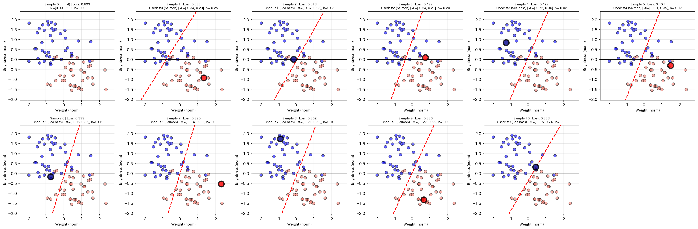

# ニューラルネットワークの仕組み：1つの変換から理解する

## はじめに

ニューラルネットワーク(NN)を理解する上で、いきなり「ノード」や「層」という概念から入ると混乱しがちです。この資料では、最もシンプルな「線形変換だけ」から始めて、段階的に理解を深めていきます。

---

## 0. 最もシンプル：線形変換だけで分類

### 問題設定
- 入力: 2次元のデータ `X = [x1, x2]`（例: 5サンプル）
- 出力: クラス0 または クラス1
- 前提: **線形分離可能な問題**（直線1本で分けられる）

### 線形変換のみの構造

**Step 1: アフィン変換**
```
z = α1·x1 + α2·x2 + b
```
- `α = [α1, α2]`: 重みベクトル（2次元）
- `b`: バイアス（スカラー）
- `z`: 結果（スカラー）

これは**アフィン変換**です：
- 線形変換 `α^T · X`（射影・回転・スケーリング）
- 平行移動 `+ b`

**幾何的な意味:**
- 2次元空間の点を、ある方向（`α`方向）に射影して1次元に落とす
- `b`でオフセットを調整

**Step 2: 確率化**
```
p = sigmoid(z) = 1 / (1 + e^(-z))
```

**Sigmoidの役割:**
- 実数全体 `(-∞, +∞)` → 0〜1の範囲に圧縮
- 大きな正の値 → 1に近づく
- 大きな負の値 → 0に近づく
- 「確率っぽい値」に変換

**分類:**
- `p ≥ 0.5` → クラス1
- `p < 0.5` → クラス0

### 学習プロセス

**学習するパラメータ:**
- `α1, α2, b` の3つだけ

**1. Forward（順伝播）**

1つのサンプル `X = [x1, x2]` を入力:
```
z = α1·x1 + α2·x2 + b
p = sigmoid(z)
```

**2. 損失計算**

予測 `p = 0.4`、正解 `y_true = 1` の場合:
```
Loss = -(y_true · log(p) + (1-y_true) · log(1-p))
     = -log(0.4)
     ≈ 0.916
```

**3. Backward（逆伝播）**

**誤差の計算:**
```
δ = p - y_true = 0.4 - 1 = -0.6
```

**パラメータの勾配:**

Sigmoidの微分を考慮すると:
```
∂Loss/∂z = δ = -0.6
```

各パラメータの勾配:
```
∂Loss/∂α1 = δ · x1
∂Loss/∂α2 = δ · x2
∂Loss/∂b = δ
```

**具体例:** `X = [2.0, 3.0]`、`δ = -0.6` の場合:
```
∂Loss/∂α1 = -0.6 · 2.0 = -1.2
∂Loss/∂α2 = -0.6 · 3.0 = -1.8
∂Loss/∂b = -0.6
```

**4. パラメータ更新**

勾配降下法で更新（学習率 `lr = 0.01` の場合）:
```
α1 ← α1 - lr · ∂Loss/∂α1 = α1 - 0.01 · (-1.2) = α1 + 0.012
α2 ← α2 - lr · ∂Loss/∂α2 = α2 - 0.01 · (-1.8) = α2 + 0.018
b  ← b  - lr · ∂Loss/∂b  = b  - 0.01 · (-0.6) = b  + 0.006
```

**5. 繰り返し**

全サンプルに対してこれを繰り返すことで:
- `α`（射影方向）が最適化される
- `b`（オフセット）が最適化される
- 損失が減少していく

### 何が起きているのか

**学習の本質:**
- `α`と`b`を調整して、`z = 0` となる直線（決定境界）を動かしている
- クラス1のサンプルが `z > 0` 側に
- クラス0のサンプルが `z < 0` 側に
- 来るように境界線を移動させている

**幾何的には:**
- `α^T · X + b = 0` という直線が決定境界
- 学習でこの直線の位置と角度を最適化

### 線形変換だけで十分なケース

**線形分離可能な問題なら:**
- この3パラメータだけで完璧に分類できる
- 非線形変換は不要
- 計算も速い、理解も簡単

**限界:**
- 直線1本でしか分けられない
- XOR問題のような非線形問題は解けない

### なぜ非線形が必要になるのか

線形変換だけだと、どれだけ重ねても:
```
z = 線形(線形(線形(X)))
  = 結局また線形(X)
```

複雑な境界（曲線、複数の境界など）を表現するには、次のセクションで説明する非線形変換が必要です。

### 実装例：Salmon vs Sea Bass分類

実際に線形変換だけで分類を学習してみます。

**データ:**
- Salmon（サーモン）: 40匹（重さ、輝度）
- Sea bass（スズキ）: 40匹（重さ、輝度）
- Salmonは輝度が暗め、Sea bassは明るめ

```python
import numpy as np

# データ準備（省略、コード全体は別ファイル参照）
# X: (80, 2) - [重さ, 輝度]を正規化したもの
# y: (80,) - Salmon=0, Sea bass=1

def sigmoid(z):
    """Sigmoid: z -> [0, 1]"""
    return 1 / (1 + np.exp(-np.clip(z, -500, 500)))

def forward(X, alpha, b):
    """Forward: X @ alpha + b -> sigmoid"""
    z = X @ alpha + b
    p = sigmoid(z)
    return z, p

def loss_fn(y_true, y_pred):
    """Binary cross entropy"""
    eps = 1e-10
    y_pred = np.clip(y_pred, eps, 1 - eps)
    return -np.mean(y_true * np.log(y_pred) + (1 - y_true) * np.log(1 - y_pred))

def backward(X, y_true, y_pred):
    """Backward: compute gradients"""
    delta = y_pred - y_true
    d_alpha = X.T @ delta / len(X)
    d_b = np.mean(delta)
    return d_alpha, d_b

# パラメータ初期化
alpha = np.array([0.0, 0.0])  # Zero initialization
b = 0.0

# 学習ループ (1サンプルずつ処理)
lr = 0.5
for i in range(10):  # 10サンプルを処理
    idx = i % len(X_norm)  # データから1つ選ぶ
    X_single = X_norm[idx:idx+1]
    y_single = y[idx:idx+1]
    
    z, p = forward(X_single, alpha, b)      # Forward (1サンプル)
    d_alpha, d_b = backward(X_single, y_single, p)  # Backward (1サンプル)
    alpha -= lr * d_alpha                   # Update
    b -= lr * d_b
```

**学習結果:**
```
Sample   0 | Loss: 0.6931 | Accuracy: 50.00% | alpha: [ 0.000,  0.000] | b:  0.000
Sample   1 | Loss: 0.6376 | Accuracy: 70.00% | alpha: [ 0.111,  0.266] | b: -0.250
Sample   2 | Loss: 0.4796 | Accuracy: 87.50% | alpha: [-0.048,  0.638] | b: -0.011
Sample   5 | Loss: 0.3934 | Accuracy: 88.75% | alpha: [-0.119,  0.992] | b: -0.043
Sample  10 | Loss: 0.3043 | Accuracy: 92.50% | alpha: [-0.681,  1.224] | b:  0.462
```

**わかること:**
- 1サンプルずつ処理していく
- パラメータが徐々に変化
- alpha2(輝度の重み)が増加 → 輝度が重要な特徴
- alpha1(重さの重み)は負 → 重いほどSalmon寄り

**完全なコードは `linear_classifier.py` を参照してください。**

### なぜ距離を直接最適化しないのか？

ここで疑問が湧くかもしれません。学習でやりたいことは「サンプルを正しい側に入れて、境界から遠ざける」なら、**点と線の距離を直接最適化すればいいのでは？**

```
距離 = |α·X + b| / ||α||
```

これを最大化すれば、まさにやりたいことです。

**でも、実際にはCross Entropy + Sigmoidを使います。なぜか？**

## 理由: 微分のしやすさ

**距離を直接使うと:**
```
d = |α·X + b| / ||α||

微分すると...
∂d/∂α = (X · sign(α·X + b) · ||α|| - α · (α·X + b) / ||α||) / ||α||²
```
- **絶対値の微分** → 0付近で微分できない(符号が反転する場所)
- **ノルム||α||の微分** → 分母と分子の両方に出現して複雑
- 計算コストも高い

**Cross Entropyを使うと:**
```
Loss = -log(sigmoid(z))  (z = α·X + b)

sigmoid(z) = 1 / (1 + e^(-z))
sigmoid'(z) = sigmoid(z) · (1 - sigmoid(z))

微分すると...
∂Loss/∂z = sigmoid(z) - y = p - y
∂Loss/∂α = (p - y) · X  ← めちゃくちゃシンプル！
```

**なぜこんなに簡単？**

Sigmoidの微分とlog(交差エントロピー)の微分が**綺麗に打ち消し合う**からです:

```
Loss = -log(p)  (正解がクラス1の場合)
∂Loss/∂p = -1/p

p = sigmoid(z)
∂p/∂z = p(1-p)

連鎖律:
∂Loss/∂z = ∂Loss/∂p · ∂p/∂z
         = -1/p · p(1-p)
         = -(1-p)
         = p - 1
```

正解が1なら `p - 1`、正解が0なら `p - 0`。つまり**常に `p - y`**という超シンプルな形！

## なぜ代替として機能するのか？

**距離最大化とSigmoid + Cross Entropyは、違う関数だけど同じ効果:**

**距離を使う場合:**
- 境界から遠い → 距離が大きい → Good
- 境界に近い → 距離が小さい → Bad

**Sigmoid + Cross Entropyを使う場合:**
- `z = α·X + b` が大きい → `p ≈ 1` → Loss小さい → Good
- `z = α·X + b` が小さい → `p ≈ 0.5` → Loss大きい → Bad

両方とも「**zの絶対値を大きくしたい**」という方向性は同じ。

**zとは何か？**
```
z = α·X + b
```
これは、点Xから決定境界(`α·X + b = 0`)までの**符号付き距離に比例する値**です。

だから:
- **距離**: 直接的に「境界からの距離」を測る
- **Sigmoid + Cross Entropy**: `z`(距離に比例)を通して、間接的に同じことをする

**要するに:**
- **やりたいこと**: 境界からの距離を最大化
- **実際にやること**: Sigmoid + Cross Entropyという、微分しやすい**代替関数**を使う
- **なぜ代替になる**: どちらも「zの絶対値を大きくする」という同じゴールに向かう
- **メリット**: 微分が超簡単(p - y)、勾配降下法で効率よく学習できる

これが、距離を直接使わずにSigmoidを使う理由です。

### 決定境界の可視化

```{python}
import numpy as np
import matplotlib.pyplot as plt

# Data
salmon_weights = [2149, 1959, 2194, 2457, 1930, 1930, 2474, 2230, 1859, 2163,
                  1861, 1860, 2073, 1426, 1483, 1831, 1696, 2094, 1728, 1576,
                  2028, 1903, 2057, 2229, 1884, 1884, 2240, 2081, 1838, 2037,
                  1839, 1838, 1978, 1554, 1591, 1820, 1731, 1992, 1752, 1652]
salmon_brightness = [3.5, 5.8, 4.9, 4.4, 2.6, 2.6, 2.2, 5.5, 4.4, 4.8, 2.1, 
                     5.9, 5.3, 2.8, 2.7, 2.7, 3.2, 4.1, 3.7, 3.2, 4.4, 2.6, 
                     3.2, 3.5, 3.8, 5.1, 2.8, 4.1, 4.4, 2.2, 4.4, 2.7, 2.3, 
                     5.8, 5.9, 5.2, 3.2, 2.4, 4.7, 3.8]
seabass_weights = [1677, 1327, 1486, 1440, 1857, 1476, 1749, 2203, 1979, 1468,
                   1496, 1737, 1099, 1341, 1748, 1563, 2181, 1414, 1286, 1333,
                   1787, 1445, 1505, 1204, 1381, 1513, 1259, 1567, 1370, 1432,
                   1370, 1864, 1488, 1278, 1657, 1245, 1533, 1096, 1223, 1531]
seabass_brightness = [5.6, 7.5, 5.2, 9.5, 6.3, 8.3, 6.6, 7.6, 7.7, 5.9, 9.8, 
                       8.9, 9.7, 9.5, 8.0, 9.6, 5.4, 6.0, 5.2, 6.6, 6.9, 6.4, 
                       9.1, 6.8, 6.4, 7.7, 5.7, 9.0, 5.4, 9.9, 8.9, 6.0, 5.0, 
                       9.1, 8.5, 8.6, 8.9, 5.4, 6.8, 5.6]

# Prepare dataset
X_salmon = np.array([[w, b] for w, b in zip(salmon_weights, salmon_brightness)])
X_seabass = np.array([[w, b] for w, b in zip(seabass_weights, seabass_brightness)])
X = np.vstack([X_salmon, X_seabass])

# Labels: Salmon = 0, Sea bass = 1
y = np.array([0] * len(salmon_weights) + [1] * len(seabass_weights))

# Normalize features
X_mean = X.mean(axis=0)
X_std = X.std(axis=0)
X_norm = (X - X_mean) / X_std

# Interleave: Salmon, Sea bass, Salmon, Sea bass, ...
salmon_indices = np.where(y == 0)[0]
seabass_indices = np.where(y == 1)[0]

shuffle_idx = np.empty(len(X_norm), dtype=int)
shuffle_idx[0::2] = salmon_indices  # Even positions: Salmon
shuffle_idx[1::2] = seabass_indices  # Odd positions: Sea bass

X_norm = X_norm[shuffle_idx]
y = y[shuffle_idx]


def sigmoid(z):
    return 1 / (1 + np.exp(-np.clip(z, -500, 500)))

def forward(X, alpha, b):
    z = X @ alpha + b
    p = sigmoid(z)
    return z, p

def loss_fn(y_true, y_pred):
    eps = 1e-10
    y_pred = np.clip(y_pred, eps, 1 - eps)
    return -np.mean(y_true * np.log(y_pred) + (1 - y_true) * np.log(1 - y_pred))

def backward(X, y_true, y_pred):
    delta = y_pred - y_true
    d_alpha = X.T @ delta / len(X)
    d_b = np.mean(delta)
    return d_alpha, d_b


def accuracy(y_true, y_pred):
    """Compute accuracy"""
    predictions = (y_pred >= 0.5).astype(int)
    return np.mean(predictions == y_true)


# Training
# Start from zero (slope=0, intercept=0) to see learning from scratch
alpha = np.array([0.0, 0.0])  # Start from origin
b = 0.0

lr = 0.5  # Learning rate for online learning
num_samples_to_process = 10  # Process 10 samples to see gradual changes

# Store parameters at each sample for visualization
history = []

print("=" * 60)
print("学習開始 - オンライン学習 (1サンプルずつ処理)")
print(f"初期パラメータ: alpha=[{alpha[0]:.3f}, {alpha[1]:.3f}], b={b:.3f}")
print("=" * 60)

# Store initial state (sample 0)
z, p = forward(X_norm, alpha, b)
loss = loss_fn(y, p)
acc = accuracy(y, p)
history.append({
    'sample': 0,
    'alpha': alpha.copy(),
    'b': b,
    'loss': loss,
    'used_idx': None  # No sample used yet
})
print(f"Sample   0 | Loss: {loss:.4f} | Accuracy: {acc:.2%} | "
      f"alpha: [{alpha[0]:6.3f}, {alpha[1]:6.3f}] | b: {b:6.3f}")

# Process samples one by one
for i in range(num_samples_to_process):
    # Pick one sample (cycle through dataset)
    idx = i % len(X_norm)
    X_single = X_norm[idx:idx+1]  # Shape (1, 2)
    y_single = y[idx:idx+1]        # Shape (1,)
    
    # Forward for this single sample
    z_single, p_single = forward(X_single, alpha, b)
    
    # Backward for this single sample
    d_alpha, d_b = backward(X_single, y_single, p_single)
    
    # Update parameters
    alpha -= lr * d_alpha
    b -= lr * d_b
    
    # Evaluate on full dataset for monitoring
    z, p = forward(X_norm, alpha, b)
    loss = loss_fn(y, p)
    acc = accuracy(y, p)
    
    # Store current parameters
    history.append({
        'sample': i + 1,
        'alpha': alpha.copy(),
        'b': b,
        'loss': loss,
        'used_idx': idx  # Which sample was used for this update
    })
    
    print(f"Sample {i+1:3d} | Loss: {loss:.4f} | Accuracy: {acc:.2%} | "
          f"alpha: [{alpha[0]:6.3f}, {alpha[1]:6.3f}] | b: {b:6.3f}")

print("=" * 60)
print(f"学習完了: alpha=[{alpha[0]:.3f}, {alpha[1]:.3f}], b={b:.3f}")
print("=" * 60)


# Visualization - show first 11 samples (0-10)
visualize_indices = list(range(0, min(11, len(history))))  # Sample 0-10
fig, axes = plt.subplots(2, 6, figsize=(24, 8))
axes = axes.flatten()

for plot_idx, hist_idx in enumerate(visualize_indices):
    h = history[hist_idx]
    ax = axes[plot_idx]
    
    # Plot data points - highlight the one that was just used
    for i in range(len(X_norm)):
        if h['used_idx'] is not None and i == h['used_idx']:
            # Highlight the sample that was just used for this update
            if y[i] == 0:  # Salmon
                ax.scatter(X_norm[i, 0], X_norm[i, 1], c='red', s=200, alpha=0.8, 
                          edgecolors='black', linewidths=3, marker='o', zorder=10)
            else:  # Sea bass
                ax.scatter(X_norm[i, 0], X_norm[i, 1], c='darkblue', s=200, alpha=0.8, 
                          edgecolors='black', linewidths=3, marker='o', zorder=10)
        else:
            # Normal samples
            if y[i] == 0:  # Salmon
                ax.scatter(X_norm[i, 0], X_norm[i, 1], c='salmon', s=50, alpha=0.6, edgecolors='k')
            else:  # Sea bass
                ax.scatter(X_norm[i, 0], X_norm[i, 1], c='blue', s=50, alpha=0.6, edgecolors='k')
    
    # Decision boundary
    x1_range = np.linspace(X_norm[:, 0].min() - 0.5, X_norm[:, 0].max() + 0.5, 100)
    x2_boundary = -(h['alpha'][0] * x1_range + h['b']) / h['alpha'][1]
    ax.plot(x1_range, x2_boundary, 'r--', linewidth=2, label='Decision boundary')
    
    ax.set_xlabel('Weight (norm)', fontsize=9)
    ax.set_ylabel('Brightness (norm)', fontsize=9)
    
    # Add info about which sample was used
    if h['used_idx'] is not None:
        sample_type = 'Salmon' if y[h['used_idx']] == 0 else 'Sea bass'
        ax.set_title(f"Sample {h['sample']} | Loss: {h['loss']:.3f}\n" + 
                     f"Used: #{h['used_idx']} ({sample_type}) | α=[{h['alpha'][0]:.2f}, {h['alpha'][1]:.2f}], b={h['b']:.2f}", 
                     fontsize=8)
    else:
        ax.set_title(f"Sample {h['sample']} (initial) | Loss: {h['loss']:.3f}\n" + 
                     f"α=[{h['alpha'][0]:.2f}, {h['alpha'][1]:.2f}], b={h['b']:.2f}", 
                     fontsize=8)
    
    ax.grid(True, alpha=0.3)
    ax.axhline(y=0, color='k', linewidth=0.5)
    ax.axvline(x=0, color='k', linewidth=0.5)
    ax.set_xlim(X_norm[:, 0].min() - 0.5, X_norm[:, 0].max() + 0.5)
    ax.set_ylim(X_norm[:, 1].min() - 0.5, X_norm[:, 1].max() + 0.5)

# All plots used (21 plots in 21 spaces)

# Hide the last subplot (we have 11 plots in 12 spaces)
axes[-1].axis('off')

plt.tight_layout()
plt.savefig('imgs/decision_boundary.png', dpi=150, bbox_inches='tight')
print("決定境界の変化を imgs/decision_boundary.png に保存しました")
plt.show()
```



**各パネルが示すもの:**
- **Sample 0**: 初期状態(alpha=[0,0])、決定境界なし
- **Sample 1**: 最初のサンプル(Salmon)で境界が出現
- **Sample 2**: 次のサンプル(Sea bass)で境界が動く
- **Sample 3-10**: SalmonとSea bassを交互に学習しながら境界が変化

**学習で何が起きているか:**
1. 各サンプル(大きな赤丸または青丸)を1つずつ処理
2. `α`(重みベクトル)が変化 → 境界の**傾き**が変わる
3. `b`(バイアス)が変化 → 境界の**位置**が変わる
4. 徐々に2つのクラスを分ける境界ができていく

**可視化コードは `visualize_boundary.py` を参照してください。**
※Windowsで実行する場合も、`imgs/decision_boundary.png` に保存されます。

---

## 1. 最もシンプルな2クラス分類

### 問題設定
- 入力: 2次元のデータ `X = [x1, x2]`（例: 5サンプル）
- 出力: クラス0 または クラス1

### 単一変換による分類

**Step 1: アフィン変換で1次元に圧縮**
```
z = α1·x1 + α2·x2 + b
```
- `α = [α1, α2]`: 重みベクトル（2次元）
- `b`: バイアス（スカラー）
- `z`: 結果（スカラー）

これは**アフィン変換**です：
- 線形変換 `α^T · X`（射影・回転・スケーリング）
- 平行移動 `+ b`

**幾何的な意味:**
- 2次元空間の点を、ある方向（`α`方向）に射影して1次元に落とす
- `b`でオフセットを調整

**Step 2: 非線形変換（活性化関数）**
```
h = ReLU(z) = max(0, z)
```
- `z > 0`なら、そのまま
- `z ≤ 0`なら、0に潰す

**非線形とは:**
- `f(ax + by) ≠ af(x) + bf(y)` となる関数
- 直線ではなく、折れ曲がったり、曲がったりする

**Step 3: さらに変換**
```
y = w·h + c
```
- `w`: 重み（スカラー）
- `c`: バイアス（スカラー）
- スケーリングとオフセット調整

**Step 4: 確率化**
```
p = sigmoid(y) = 1 / (1 + e^(-y))
```

**Sigmoidの役割:**
- 実数全体 `(-∞, +∞)` → 0〜1の範囲に圧縮
- 大きな正の値 → 1に近づく
- 大きな負の値 → 0に近づく
- 「確率っぽい値」に変換

**分類:**
- `p ≥ 0.5` → クラス1
- `p < 0.5` → クラス0

---

## 2. 学習：パラメータの最適化

### 学習するパラメータ
合計5個のパラメータ:
- `α1, α2`（2個）: アフィン変換の重み
- `b`（1個）: アフィン変換のバイアス
- `w`（1個）: 2段目の重み
- `c`（1個）: 2段目のバイアス

### 学習の流れ

**1. Forward（順伝播）**
1つのサンプル `X = [x1, x2]` を入力:
```
z = α1·x1 + α2·x2 + b
h = ReLU(z)
y = w·h + c
p = sigmoid(y)
```

**2. 損失計算**
予測 `p = 0.4`、正解 `y_true = 1` の場合:
```
Loss = -(y_true · log(p) + (1-y_true) · log(1-p))
     = -log(0.4)
     ≈ 0.916
```
※正解が1なのに0.4しか出せていない → 大きな損失

**3. Backward（逆伝播）**

**出力層の誤差:**
```
δ_out = p - y_true = 0.4 - 1 = -0.6
```
（デルタδは誤差・勾配を表す記号）

**出力層のパラメータ更新:**
```
w ← w - lr · δ_out · h
c ← c - lr · δ_out
```
- `lr`: 学習率（learning rate、どれくらい動かすか）

**中間層への誤差伝播:**
```
δ_mid = δ_out · w · f'(z)
```
- `w`: 出力層の重み（**更新前**の値を使う）
- `f'(z)`: 活性化関数の微分
  - ReLUの場合: `z > 0`なら1、`z ≤ 0`なら0

**具体例:**
- `δ_out = -0.6`
- `w = 0.5`（仮の値）
- `z = 2.0`（仮の値、`z > 0`）
- `f'(2.0) = 1`（ReLUの微分）

```
δ_mid = -0.6 · 0.5 · 1 = -0.3
```

**中間層のパラメータ更新:**
```
α1 ← α1 - lr · δ_mid · x1
α2 ← α2 - lr · δ_mid · x2
b  ← b  - lr · δ_mid
```

**重要なポイント:**
- 誤差を逆に伝播させる際は**更新前の重み**を使う
- Forward時に通った経路を逆に辿る必要があるため
- 更新された重みは**次のForwardパス**で初めて使われる

**4. 勾配降下法**
これは**勾配降下法**と同じ原理:
```
パラメータ ← パラメータ - lr · (勾配)
```
- 損失関数を各パラメータで微分
- 微分の逆方向に少し動かす
- 損失が減る方向に最適化

---

## 3. 何が起きているのか

### 2回の変換
この構造には**2回の変換**があります:

**1回目: 中間の変換**
```
z = α^T · X + b  (2次元 → 1次元)
h = ReLU(z)      (活性化)
```

**2回目: 出力の変換**
```
y = w · h + c    (1次元 → 1次元)
p = sigmoid(y)   (確率化)
```

中間の変換だけで分離できる問題でも、出力の変換がもう1回あることで:
- スケーリングやオフセットの調整ができる
- 柔軟性が増す

### 結局は境界面を作っているだけ

2クラス分類で行っていることは:
- **決定境界（境界面）を作る**
- その境界でどちら側かを判定

線形分離可能な問題なら直線、非線形ならReLUの折れ曲がりで曲線の境界を作ります。

最終的に `p = 0.5` となる点の集合が決定境界になります。

### 非線形変換の重要性

もし活性化関数（ReLU、Sigmoidなど）がなかったら:
```
全体 = 線形 → 線形 → 線形 = 結局1つの線形変換
```

非線形があることで:
- 曲がったり折れたりする複雑な境界を表現できる
- 単純な線形変換の組み合わせ以上のことができる

---

## 4. 中間を2つの変換にする（2ノード）

### 構造の変化

ここで初めて「ノード」という概念が意味を持ちます。しかし本質的には、**独立した変換が複数ある**というだけです。

**中間の変換（2つ）:**
```
z1 = α1^T · X + b1  (第1の変換)
z2 = α2^T · X + b2  (第2の変換)

h1 = ReLU(z1)
h2 = ReLU(z2)
```
- `α1, α2`: それぞれ2次元の重みベクトル
- `b1, b2`: それぞれスカラーのバイアス
- 出力: `h = [h1, h2]`（2次元ベクトル）

**出力の変換:**
```
y = w1·h1 + w2·h2 + c
  = [w1, w2] · [h1, h2] + c
```
- `w = [w1, w2]`: 2次元の重みベクトル
- `c`: スカラーのバイアス
- 出力: スカラー

**シグモイド:**
```
p = sigmoid(y)
```

### パラメータ数
- `α1 = [α11, α12]`: 2個
- `α2 = [α21, α22]`: 2個
- `b1, b2`: 2個
- `w1, w2`: 2個
- `c`: 1個
- **合計9個**

### 各変換は超平面を作る

**各変換の幾何的意味:**
```
z1 = α1^T · X + b1 = 0
```
これは2次元空間での**直線（超平面）**:
- `α1`が法線ベクトル（境界の向き）
- `b1`がオフセット（境界の位置）

ReLUを通すと:
- この超平面で空間を2つに分ける
- 片側（`z1 > 0`）はそのまま
- 片側（`z1 ≤ 0`）は0に潰す

**2つの変換がある場合:**
- 各変換が独立に超平面を作る
- 2本の直線で空間を分割
- それらの組み合わせで複雑な領域を表現

### 独立性と投票

**Forward時:**
- 各変換は**独立に**超平面を作る
- 出力層で線形結合（投票的）

**Backward時:**
- 出力層の誤差が両方の変換に伝わる
- `w1, w2`の値によって、各変換への誤差配分が変わる
- 同じ目的（損失削減）に向けて調整される

```
δ_mid1 = δ_out · w1 · f'(z1)
δ_mid2 = δ_out · w2 · f'(z2)
```

**「協調」ではなく:**
- 共通の損失関数から勾配の配分を受ける
- 各変換は独立に自分のパラメータを更新
- 直接的な相互作用はない

---

## 5. 各変換が同じにならないようにする

### 問題: パラメータの冗長性

もし2つの変換が同じパラメータになったら:
```
α1 = α2, b1 = b2
→ h1 = h2 (常に同じ出力)
→ 実質1つの変換と同じ
```

「同じ」とは:
- 厳密に同じ数値である必要はない
- **全データに対して実質同じ切り方、出力になる**こと
- 例: `α1 ≈ k·α2, b1 ≈ k·b2`（比例関係）でも冗長

### 解決策1: 異なる初期値

**対称性を破る:**
- 各パラメータを**独立に**ランダム初期化
- `α1, α2, w1, w2`を異なる値にする
- これで最初から違う超平面を作る

**初期化がランダムだから:**
- 完全に同じ初期値になる確率は天文学的に低い
- 異なる出発点から学習が始まる

**ただし:**
- 途中で似た値に収束することはありえる
- 理論的には完全一致も可能（確率的にほぼ0）

### 解決策2: Dropout

**ランダムにミュート（mute）:**
```
通常時:
入力 → [変換1: ON ] → 出力
      [変換2: ON ]

Dropout適用時（例）:
入力 → [変換1: MUTE] → 出力
      [変換2: ON   ]

次のステップ:
入力 → [変換1: ON  ] → 出力
      [変換2: MUTE]
```

**学習中:**
- 各変換を確率p（例: 50%）でランダムに無効化
- 変換は「いつ消されるかわからない」状態で学習
- 他の変換に依存できない
- → 独自の特徴を学習せざるをえない

**推論時（本番）:**
- 全変換をON
- 出力をp倍にスケーリング（学習時との整合性）

**2つの変換の場合:**
- 両方生きてる
- 変換1だけ
- 変換2だけ
- 両方消える（確率25%、その1ステップは学習が進まない）

変換数が少ない場合、Dropoutよりも**初期化の違い**の方が重要です。

### 正則化は別の目的

**L2正則化（Weight Decay）:**
```
損失関数 = CrossEntropy + λ·(||α1||² + ||α2||² + ||w||² + ...)

更新式:
α ← α - lr·(勾配 + λ·α)
  = α·(1 - lr·λ)
```

**やっていること:**
- **αに比例して減らす**
- 大きいαほどたくさん削られる
- パラメータを小さく保つ

**目的:**
- 過学習を防ぐ
- パラメータが大きくなりすぎるのを防ぐ
- **各変換が同じになるのを防ぐわけではない**

**L1正則化:**
```
α ← α - lr·λ·sign(α)
```
- 一定量を減らす（値の大きさ無関係）
- 小さい値は0になりやすい
- スパース化（一部の重みを0にする）

---

## 6. 出力層の役割

### 出力層は必要？

1つの変換の場合、出力層 `y = w·h + c` は:
- 1次元 → 1次元の変換
- スケーリングとオフセット

**理論的には:**
- 中間の出力を直接sigmoidに入れても動く
- `p = sigmoid(h)` でも分類可能

**でも出力層があると:**
1. **柔軟性が増す**
   - 中間は「良い特徴空間」を作ることに専念
   - 出力層で最終調整（スケール・閾値）

2. **拡張性**
   - 多クラス分類への拡張が自然
   - 中間が複数になっても対応できる

3. **構造の一貫性**
   - パラメータ2個（w, c）増えるだけ
   - 標準的な構造として実装

### 一般化: 出力層の各ノードは線形結合

**どんなNNでも出力層の構造は:**
```
y = w^T · h + c  (線形結合)
p = 活性化関数(y)
```

**活性化関数は問題によって変わる:**
1. **2クラス分類:** Sigmoid（0〜1の確率）
2. **多クラス分類:** Softmax（複数クラスの確率分布）
3. **回帰問題:** なし/恒等関数（実数値をそのまま）
4. **その他:** ReLU, tanhなど

---

## 7. 構造のスケーリング

### 100層、100個の変換でも原理は同じ

**プログラム的には:**
```python
# Forward
for layer in layers:
    z = W @ x + b
    h = relu(z)
    x = h  # 次の層へ

# Backward
for layer in reversed(layers):
    grad = delta * relu_grad(z)
    dW = grad @ x.T
    db = grad
    delta = W.T @ grad  # 前の層へ
    
    W -= lr * dW
    b -= lr * db
```

**構造は同じ:**
- ループ回すだけ
- 各層で同じ処理の繰り返し
- 100層でも1000層でもプログラムは簡単

**各層の計算:**
- `z = W @ x + b`（線形変換、アフィン変換）
- `h = f(z)`（活性化関数）
- 微分も簡単（ReLU、Sigmoidなど）

---

## まとめ

1. **NNの本質は変換の組み合わせ**
   - 1つの変換から理解できる
   - 「ノード」は変換のモジュール化

2. **線形変換 + 非線形活性化**
   - 各変換は `z = α^T·X + b`（アフィン変換）
   - 活性化関数で非線形性を導入

3. **学習は勾配降下法**
   - Forward: 順番に計算
   - Backward: 誤差を逆に伝播
   - パラメータを損失が減る方向に更新

4. **複数の変換は独立**
   - 各変換が超平面を作る
   - 出力層で線形結合
   - 初期値の違いとDropoutで多様性確保

この理解があれば、より複雑なNNも段階的に理解できます。
